## 准备工作
1. 小程序代码包
2. 小程序开发者工具
3. 第三方平台添加的开发小程序，并设置自己为开发者
4. 安装 Taro 开发工具 `@tarojs/cli`

    使用 npm 或者 yarn 全局安装，或者直接使用npx
```
# 使用 npm 安装 CLI
$ npm install -g @tarojs/cli
# OR 使用 yarn 安装 CLI
$ yarn global add @tarojs/cli
# OR 安装了 cnpm，使用 cnpm 安装 CLI
$ cnpm install -g @tarojs/cli
```
    进入源码目录安装依赖
```
# 使用 yarn 安装依赖
$ yarn
# OR 使用 cnpm 安装依赖
$ cnpm install
# OR 使用 npm 安装依赖
$ npm install
```
5. 使用命令生成多端小程序代码包

    微信小程序

    选择微信小程序模式，需要自行下载并打开[微信开发者工具](https://developers.weixin.qq.com/miniprogram/dev/devtools/download.html)，然后在项目编译完后选择项目根目录下 dist_weapp 目录进行预览。

    微信小程序编译预览及打包（build模式 将不会监听文件修改，并会对代码进行压缩打包）
```
# yarn
$ yarn dev:weapp
$ yarn build:weapp
# npm script
$ npm run dev:weapp
$ npm run build:weapp
```

    支付宝小程序

    选择支付宝小程序模式，需要自行下载并打开[支付宝小程序开发者工具](https://docs.alipay.com/mini/ide/overview)，然后在项目编译完后选择项目根目录下 dist_alipay 目录进行预览。

    支付宝小程序编译预览及打包（build模式 将不会监听文件修改，并会对代码进行压缩打包）
```
# yarn
$ yarn dev:alipay
$ yarn build:alipay
# npm script
$ npm run dev:alipay
$ npm run build:alipay
```

    百度小程序

    选择百度小程序模式，需要自行下载并打开[百度开发者工具](https://smartprogram.baidu.com/docs/develop/devtools/show_sur/)，然后在项目编译完后选择项目根目录下 dist_swan 目录进行预览。

    百度小程序编译预览及打包（build模式 将不会监听文件修改，并会对代码进行压缩打包）
```
# yarn
$ yarn dev:swan
$ yarn build:swan
# npm script
$ npm run dev:swan
$ npm run build:swan
```

## **微信小程序**
    
### 1.下载安装微信开发者工具
> 下载地址：https://developers.weixin.qq.com/miniprogram/dev/devtools/download.html

### 2.开发小程序绑定微信开发者
> 绑定说明：https://developers.weixin.qq.com/miniprogram/introduction/#绑定开发者

### 3.用开发者工具打开小程序代码包，检查无误，点击上传
> 说明：必须先在第三方平台有绑定过的开发小程序，开发小程序把自己绑定为开发者

配置域名
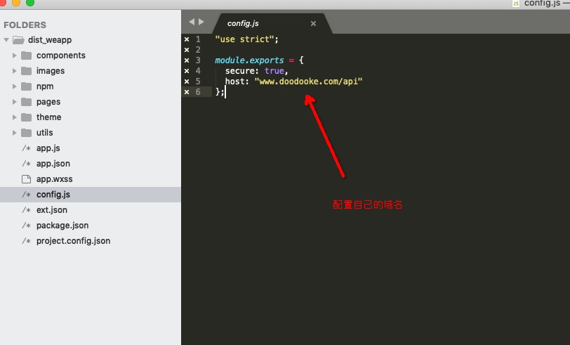
配置开发小程序appid
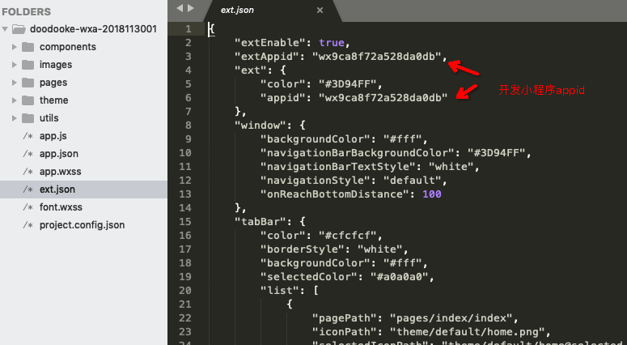
用开发者工具打开代码包
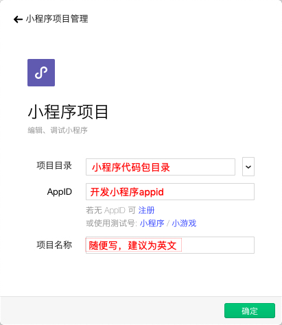
打开不校验域名
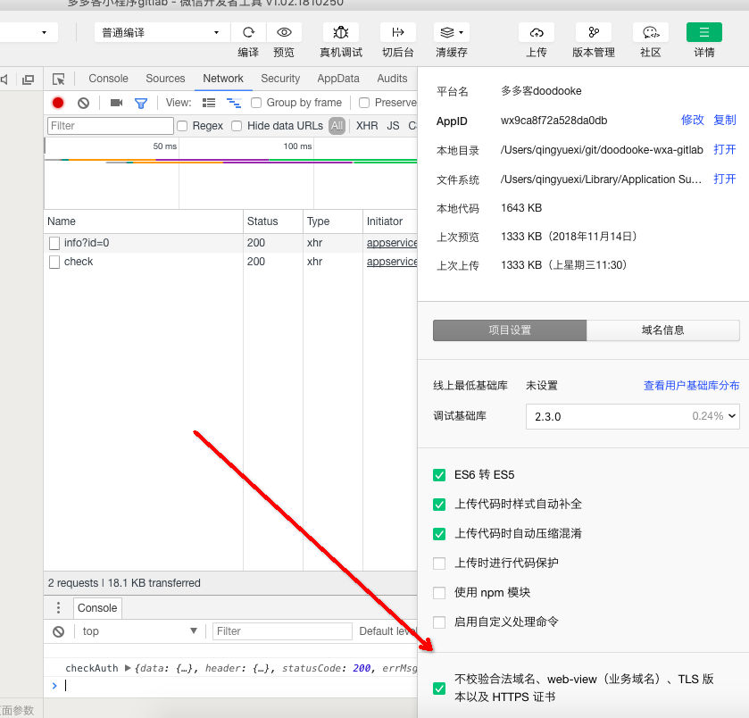
查看控制台左边显示的模板是否是开发者小程序授权应用的模板，如果不是请检查域名配置，开发小程序appid
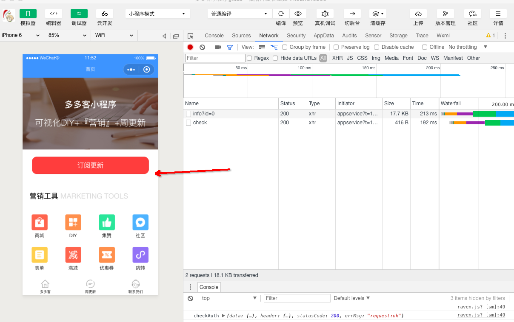
确认无误，点击开发工具右上角上传按钮

### 4.打开微信开放平台
添加到模板库
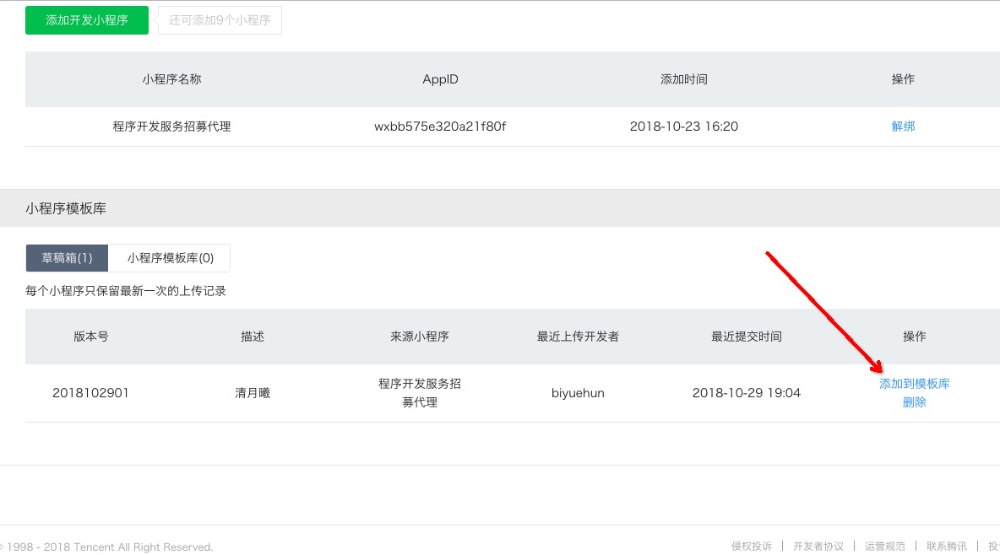
找到TemplateID
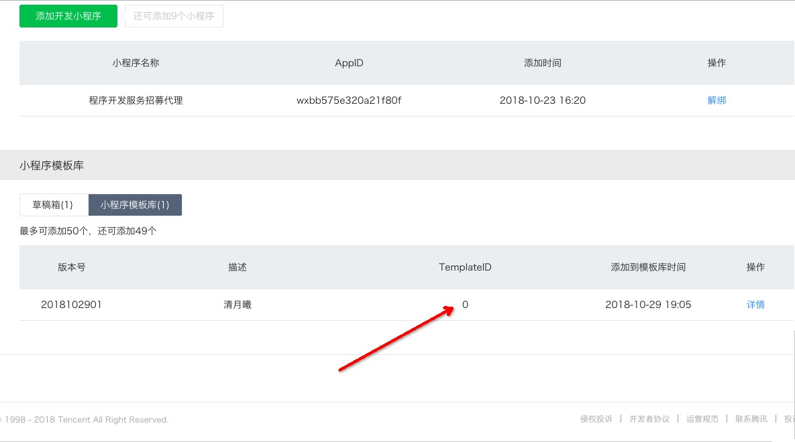

### 5.打开超管后台修改 TemplateID
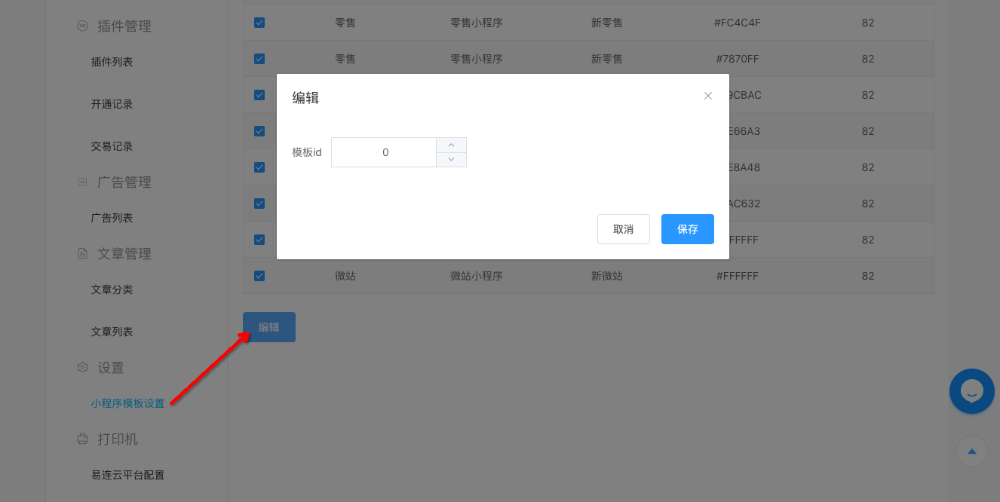

## **支付宝小程序**

### 1.下载安装支付宝小程序开发者工具
> 下载地址：https://docs.alipay.com/mini/ide/overview

### 2.创建支付宝小程序模板并添加开发成员

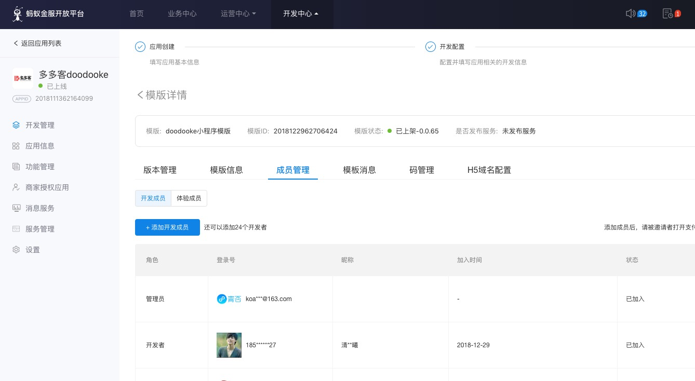
### 3.用开发者工具打开小程序代码包，检查无误，点击上传

配置域名

用开发者工具打开代码包
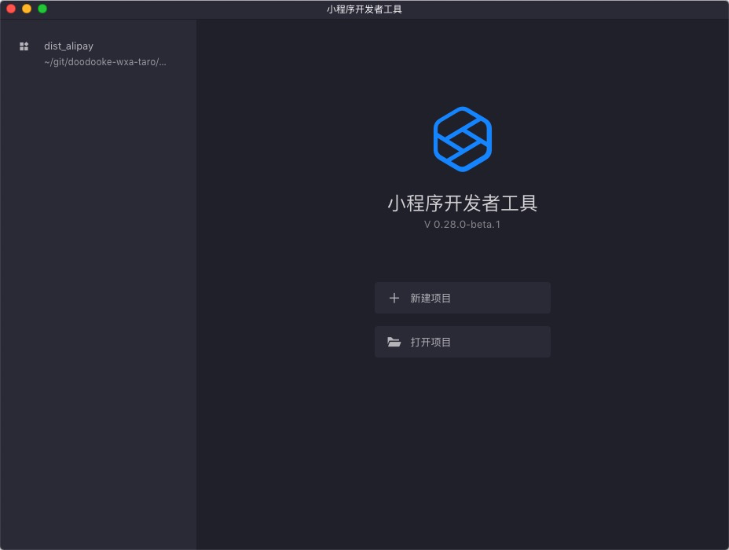
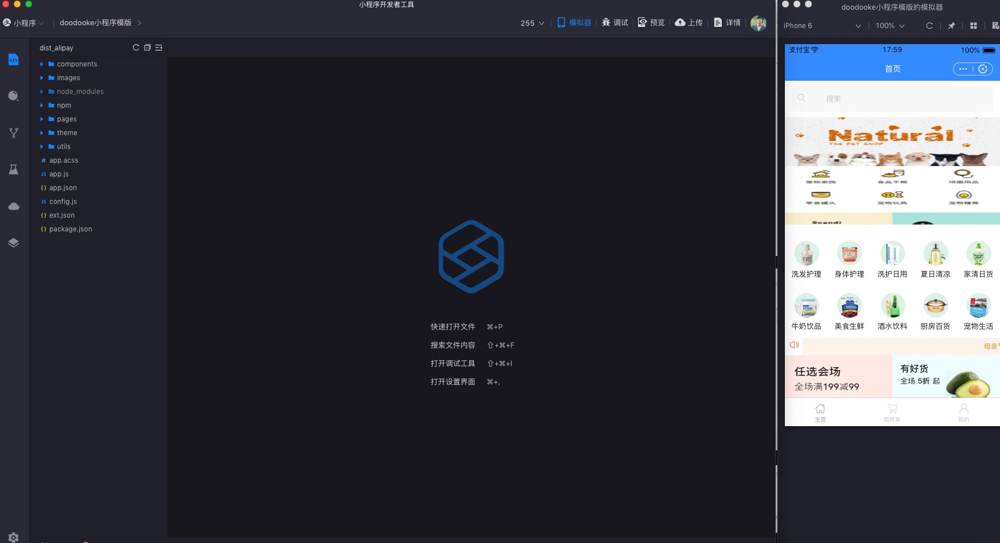
查看控制台左边显示的模板是否是开发者小程序授权应用的模板，如果不是请检查域名配置，开发小程序appid
确认无误，点击开发工具右上角上传按钮

### 4.打开支付宝开放平台
添加到版本管理提交审核
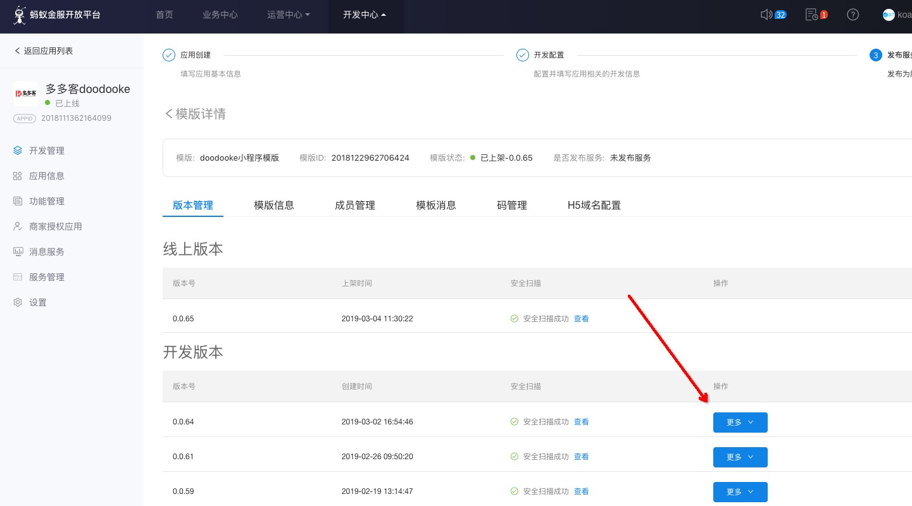
找到模板ID和审核通过的版本号

### 5.打开超管后台修改 模板ID和审核通过的版本号

## **百度小程序**

### 1.下载安装百度小程序开发者工具
> 下载地址：https://smartprogram.baidu.com/docs/develop/devtools/show_sur/

### 2.绑定开发小程序并绑定开发者

### 3.用开发者工具打开小程序代码包，检查无误，点击上传
> 说明：必须先在第三方平台有绑定过的开发小程序，开发小程序把自己绑定为开发者

配置域名

用开发者工具打开代码包
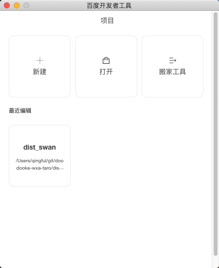
打开不校验域名
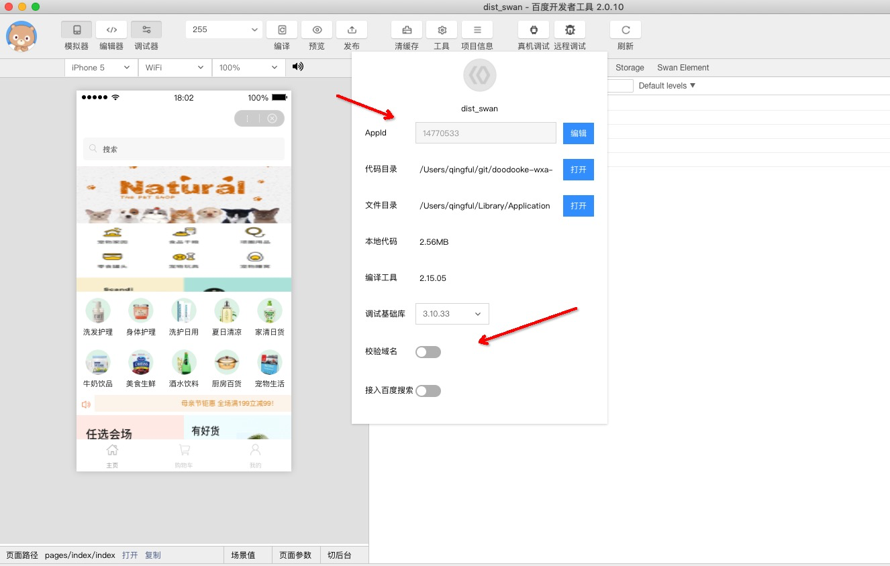
查看控制台左边显示的模板是否是开发者小程序授权应用的模板，如果不是请检查域名配置，开发小程序appid
确认无误，点击开发工具上方上传按钮（如第三方平台未找到上传的版本，请删除ext.json文件，重启开发者工具再次上传）

### 4.打开百度开放平台
添加到模板库
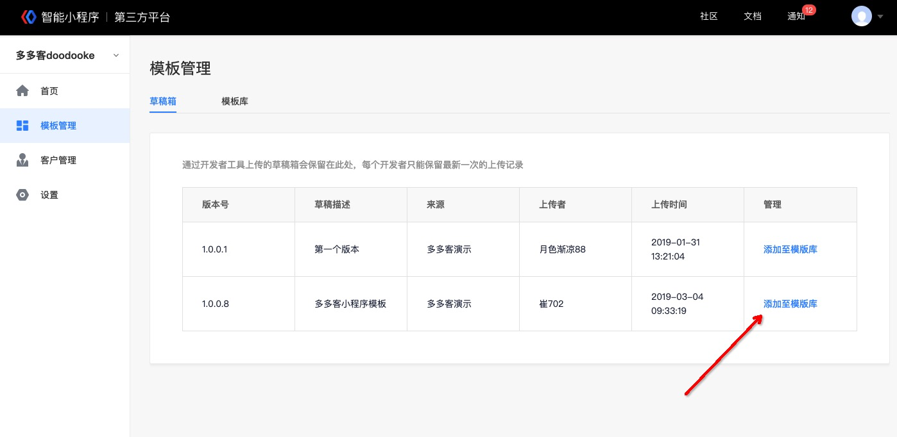
找到模板ID
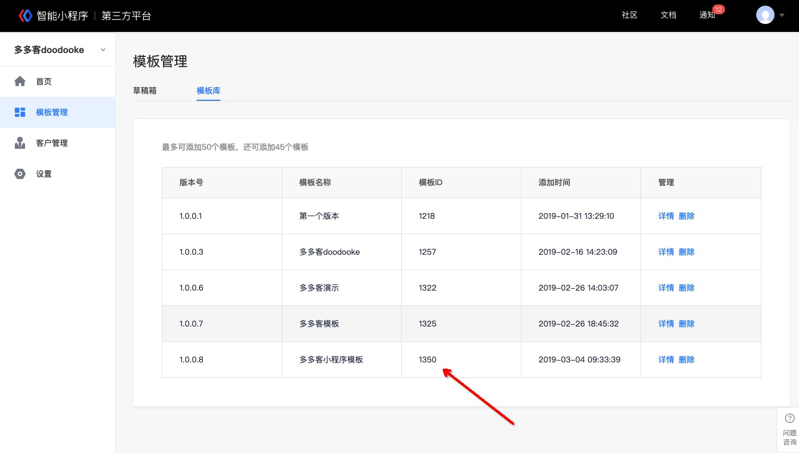

### 5.打开超管后台修改 百度模板ID

