## **config.yml**

### 应用配置
```
app:
    port: '3000'                //端口号
    host: 'https://www.xxx.com' //域名
    prefix: /api    //前缀
    free_days: 7    //默认开通应用免费天数
```

### 验证码
```
verify:
    maxip: 36            //验证码最大ip限制
    maxphone: 6          //验证码最大个数限制
```

### MYSQL数据库链接
```
mysql:
    host: 127.0.0.1      //服务器地址
    user: root           //数据库用户名
    password: xxx        //数据库密码
    database: xxx        //数据库名
    port: 3306           //数据库端口号
    charset: utf8mb4     //数据库编码
```

### REDIS链接
```
redis:
    host: 127.0.0.1    //主机地址
    port: 6379         //端口
    prefix: 'xxx:'     //前缀
```

### 七牛云
!> https://www.qiniu.com/

```
qiniu:
    accesskey: xxx                  //七牛云AccessKey
    secretkey: xxx                  //七牛云SecretKey
    bucket: xxx                     //七牛云存储空间名称
    domain: 'http://img.xxx.com'    //七牛云绑定域名
```
新建存储空间，绑定域名
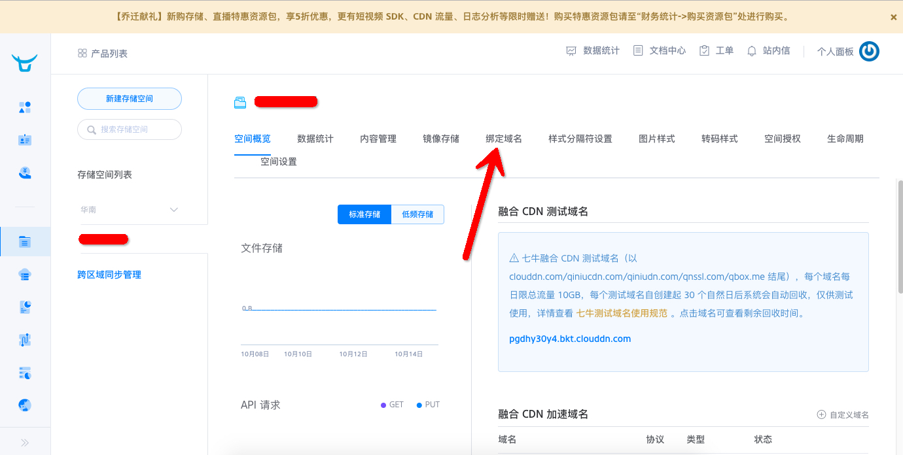
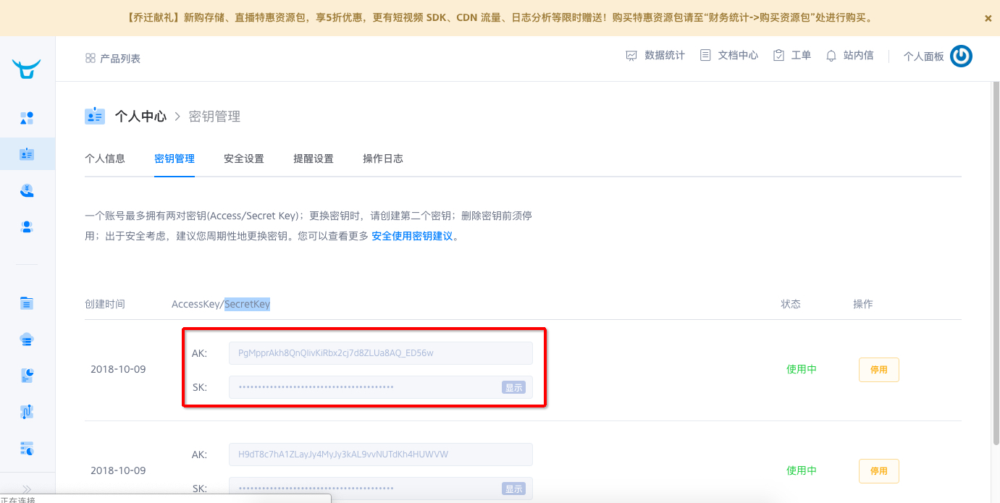

### 分页
```
page:
    size: 20
```

### jwt配置
!> https://www.npmjs.com/package/jsonwebtoken
```
jwt:
    secret: xxx                //加解密key
    expiresin: 7 days          //有效期
    admin_secret: xxx          //admin模块加解密key
    admin_expiresin: 7 days    //admin模块有效期
```

### 微信开放平台 
!> https://open.weixin.qq.com/
```
open:
    appid: xxx                    //微信开放平台AppID
    appsecret: xxx                //微信开放平台AppSecret
    token: xxx                    //微信开放平台消息校验Token
    encodingaeskey: xxx           //微信开放平台消息加解密Key
    domain: 'https://api.xxx.com' //微信开放平台域名
```
```
授权登录相关
登录授权的发起页域名      www.xxx.com
授权测试公众号列表        xxxxx 小程序原始ID
授权事件接收URL          https://www.xxx.com/api/app/home/wxa/open/wxaNotice

授权后实现业务
消息校验Token           xxxxx 随便写
消息加解密Key           xxxxxxxxx 随便写
消息与事件接收URL        https://www.xxx.com/api/app/home/wxa/open/wxaMsg/$APPID$
小程序服务器域名         www.xxx.com
小程序业务域名           www.xxx.com
```
创建第三方平台，如需上传文件传到.env同级的www目录下即可
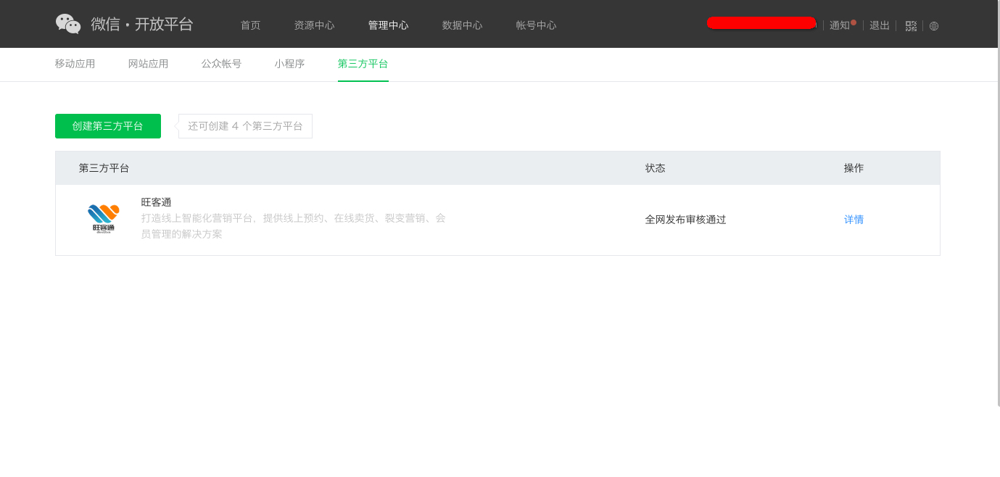
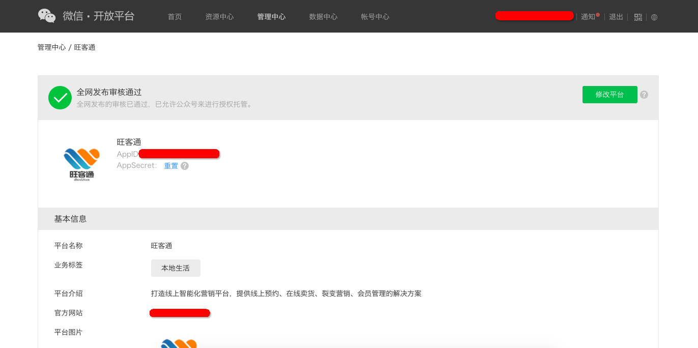
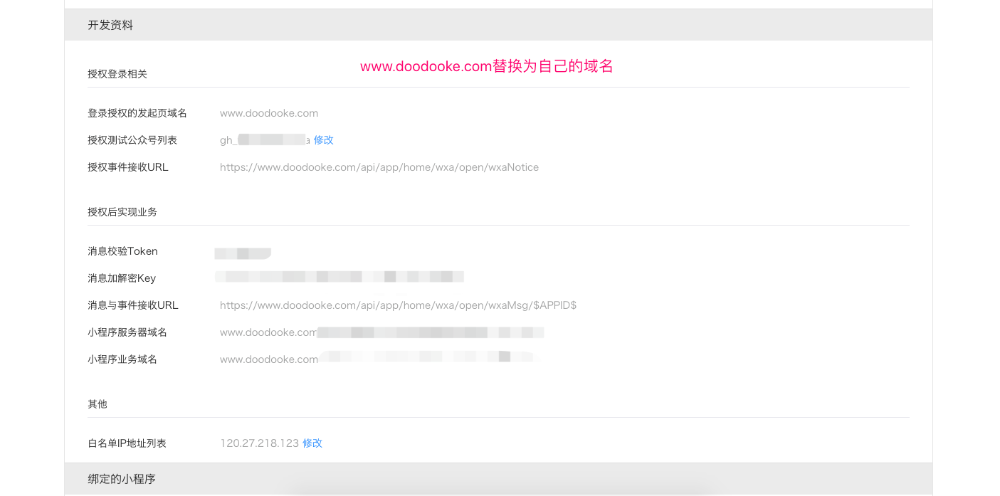

### 支付宝开放平台
!> https://open.alipay.com
```
alipay:
    open_appid: '2018111362164099'    //支付宝第三方appid
    open_sandbox: 'false'    //支付宝第三方沙箱
    open_private_key: xxx    //支付宝第三方私钥
    open_public_key: xxx     //支付宝第三方公钥
    tplmsg_at0131: xxx       //支付宝小程序模板消息AT0131
    account: xxx    //支付宝支付账号
    partner: xxx    //支付宝支付合作伙伴身份
    key: xxx        //支付宝支付MD5密钥
```
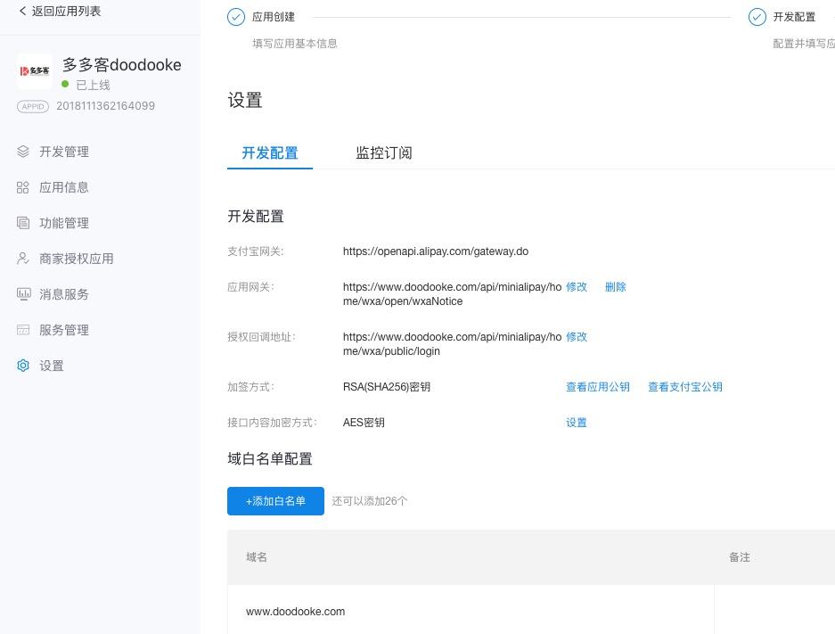
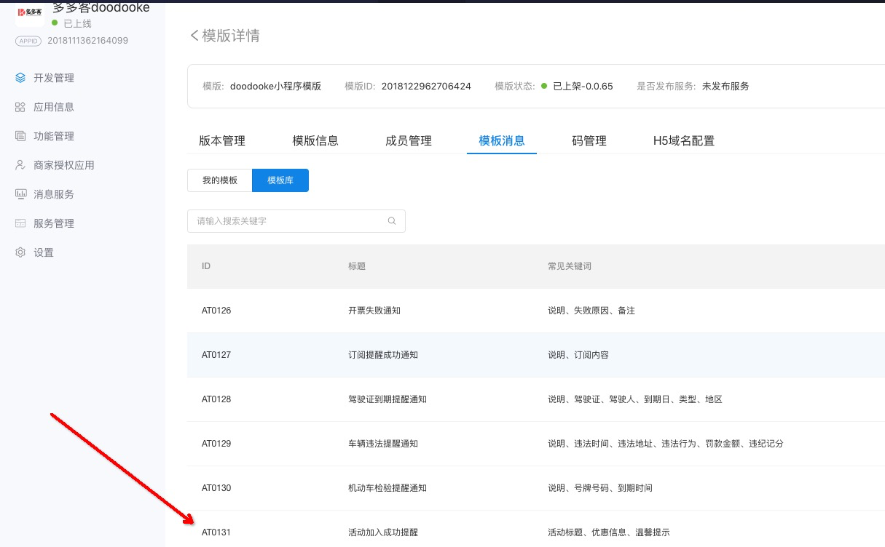
商家服务-商户信息管理-查看PID|KEY 
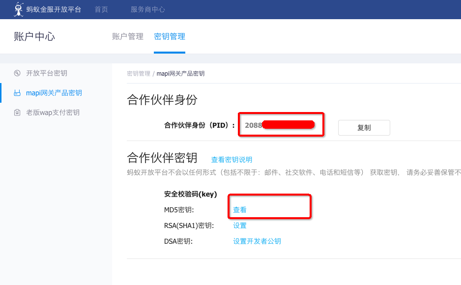

### 微信服务号
!> https://mp.weixin.qq.com
```
wx:
    appid: xxx            //微信服务号开发者ID(AppID)
    appsecret: xxx        //微信服务号开发者密码(AppSecret)
    token: xxx            //微信服务号令牌(Token)
    encodingaeskey: xxx   //微信服务号消息加解密密钥(EncodingAESKey)
```
配置如下图
https://www.xxx.com/api/app/home/wechat/index
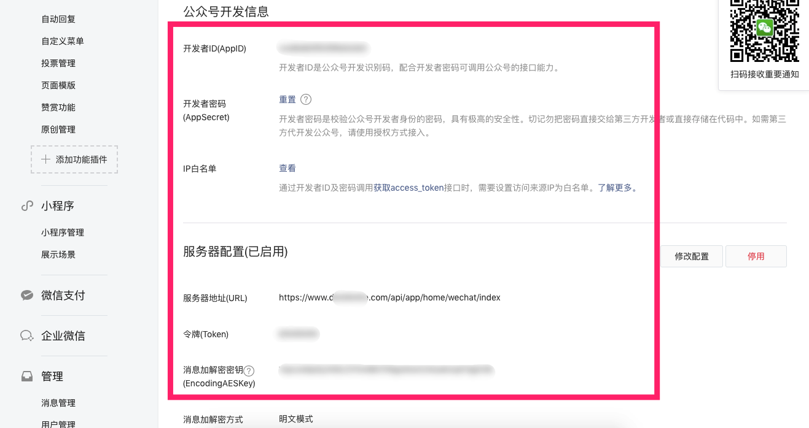

### 阿里云短信配置
```
alisms:
    type: 2                //1阿里大雨 2阿里云
    appkey: xxx            //短信AccessKey ID
    appsecret: xxx         //短信Access Key Secret
    free_sign_name: xxx    //短信签名
    template_code: xxx     //短信模版CODE
```
添加一个签名
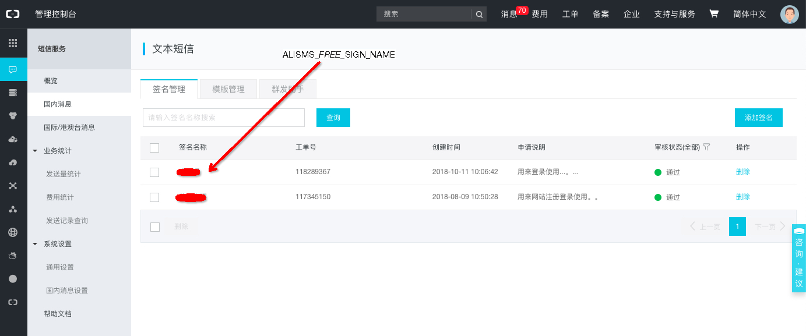
添加一个模版：尊敬的用户, 您的验证码是${code}，请及时输入验证码完成操作。
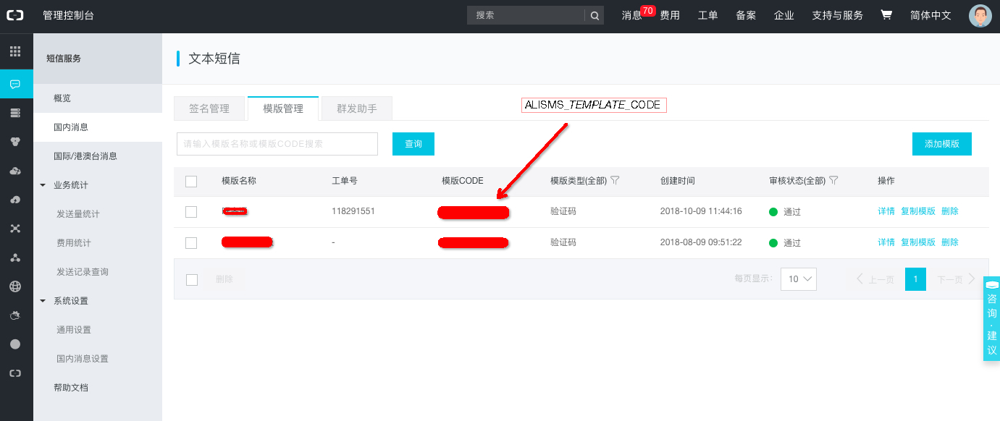
ALISMS_APPKEY和ALISMS_APPSECRET参数，请打开右上角头像accesskeys，如下图
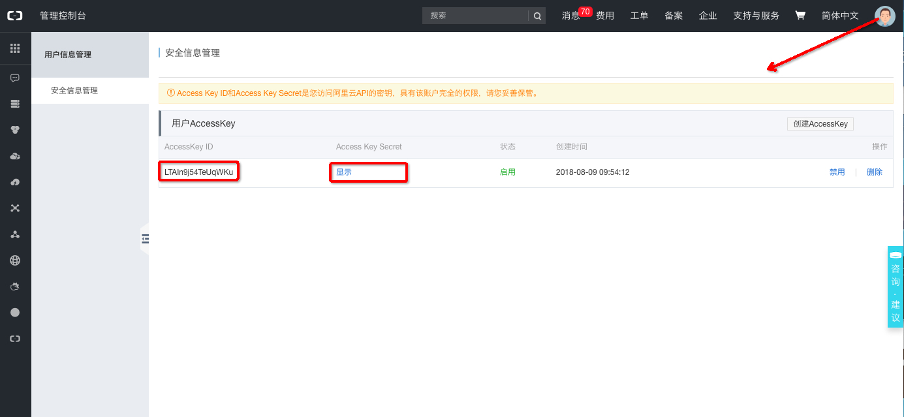

### 高德地图key值
```
lbs:
    amap_key: xxx    //高德地图key值
```
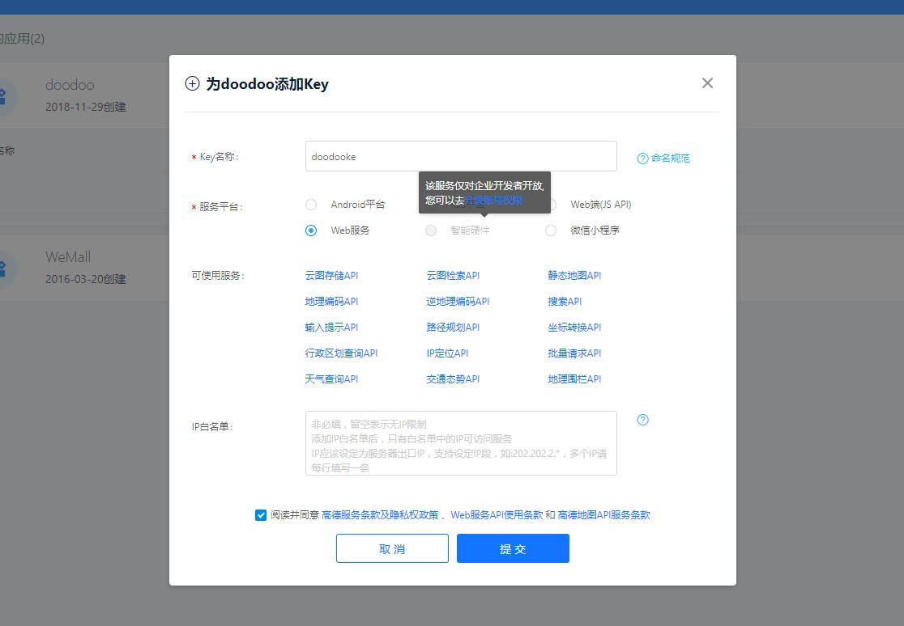

### 百度开放平台
!> https://smartprogram.baidu.com
```
swan:
    appid: xxx    //百度小程序第三方平台ID
    appkey: xxx    //百度小程序第三方平台Key
    appsecret: xxx    //百度小程序第三方平台密钥
    encrypted: xxx    //百度小程序第三方平台消息加解密Key
    payappkey: xxx    //百度支付KEY
    paydealid: xxx    //百度支付DealID
```
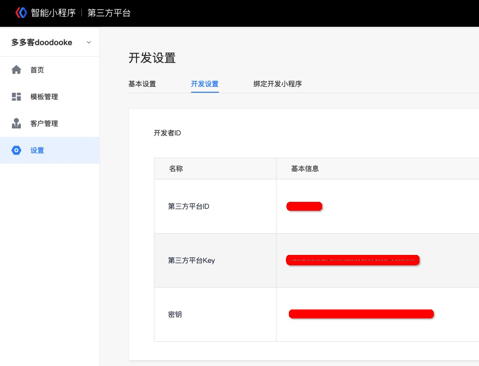
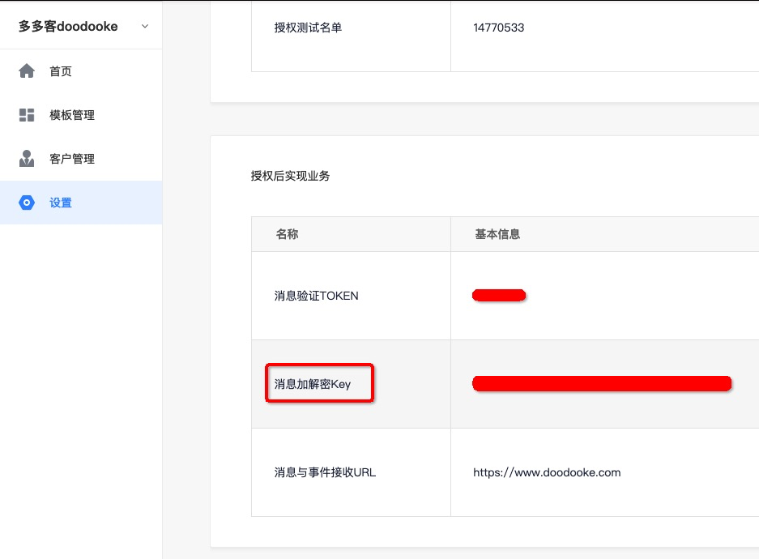
百度小程序的支付（https://mct.y.nuomi.com）
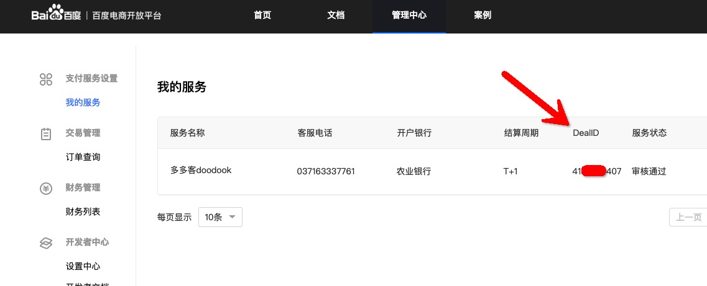
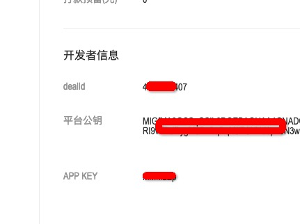

### 开发者提现手续费
```
developer:
    tixian_fee: 0.006    //千分之六
```

## **web.config.yml**

### 参数配置

```
brand: 多多客 (注：品牌)
head:
    title: 多多客小程序_微信小程序_微信小程序开发_微信小程序工具_微信小程序制作平台
    meta_description: 多多客是国内领先的微信小程序开发平台，制作过程无需代码，可视化拖拽组件即可，提供海量小程序行业模板，联合服务商、开发者、运营专家，共建服务生态，服务百万商家。
    meta_keywords: 多多客,多多客小程序，微信小程序，小程序，微信小程序开发，微信小程序平台，小程序开发，小程序制作，小程序api，小程序开发工具，小程序开发平台，微信小程序开发工具，微信小程序制作
    script: xxx,xxx (注：添加SCRIPT链接，多个以英文逗号分隔，比如可以配置在线客服系统的链接)
    link: xxx,xxx (注：添加LINK，多个以英文逗号分隔，比如引入css文件)
tel: 0371-63337761 (注：服务电话)
kaidian:
    zixun: 开店咨询：0371-63337761 (注：开店咨询)
work:
    time: 周一到周日 09:00 ~ 18:00 (注：工作时间)
fuwu:
    zixun: 服务咨询：09:00 - 18:00 (注：服务咨询)
wx:
    qrcode_url: https://open.weixin.qq.com/qr/code?username=gh_31d97ff84aa6 (注：公众号二维码 原始ID)
    kefu: /www/img/kefu/weixin.png (注：微信客服 plugin/web/static/www/img/kefu/weixin.png 430x430 ,可直接把plugin/web/static/www/目录下的内容拷贝到根目录www/www/下修改,防止升级文件覆盖)
logo: /assets/logo.png (注：修改admin端登陆页logo plugin/web/static/assets/logo.png 102x40,可直接把plugin/web/static/assets/目录下的内容拷贝到根目录www/assets/下修改,防止升级文件覆盖)
qq:
    url: http://wpa.qq.com/msgrd?v=3&uin=3367414088&site=qq&menu=yes (注：qq链接)
weibo:
    url: https://weibo.com/u/2335966217?is_hot=1 (注：weibo链接)
meiqia:
    jiaocheng: http://www.doodooke.com/cms/article/kefuxiaoxiduijiemeiqia (注：客服消息接入美洽教程链接)
copyright: Copyright © 2018 doodooke.com All Rights Reserved
icp: 豫ICP备16009619号
gongan:
    icp: 豫公网安备 41010502002866号
link:
    name: koahub软件市场
    url: 'http://www.koahub.com'


```
### 常见问题

1. 可直接把app/app/static/logo目录下的内容拷贝到根目录www/logo下替换logo，不要直接修改app/app/static/logo目录下的logo，防止升级覆盖
2. 修改浏览器左上角logo www/logo/www.png 102x40
3. 修改小程序端版权 www/logo/wxa.png 330x120


