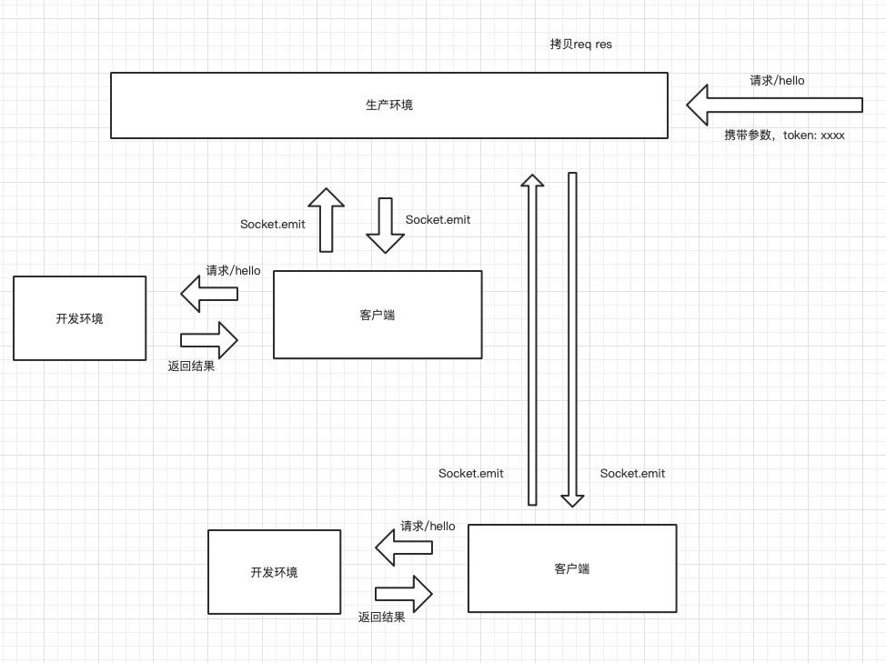

### 本地调试

本地调试原理是将线上请求内网穿透到本地，本地请求返回结果给线上。

#### 

客户端代码如下

```
const got = require("got");
const socketIo = require("socket.io-client");

const securityCode = "0328f649-06a6-43b5-953c-7167af13a348" // 输入你的安全码
const remoteUrl = "https://www.doodooke.com" // 输入你的域名
const remoteUrl = "http://127.0.0.1:3000" // 输入你开发环境的地址
const uniqueToken = "" // 默认是空，如果设置请求的header也要设置

const socket = socketIo(
    `${remoteUrl}?type=debug&securityCode=${securityCode}&uniqueToken=${uniqueToken}`,
    {
        transports: ['websocket', 'polling']
    }
);

socket.on("connect", async () => {
    console.log("Connected")
});

socket.on("disconnect", async () => {
    console.log("Disconnected")
});

socket.on("exit", async (msg) => {
    console.log(msg)
    process.exit();
});

socket.on("req", async (ctx) => {
    const uid = ctx.uid;

    let response;
    try {
        response = await got({
            method: ctx.method,
            baseUrl: localUrl,
            url: ctx.url,
            headers: ctx.headers,
            form: ctx.body
        });
    } catch (err) {
        response = err.response;
    }

    socket.emit('res', {
        uid: uid,
        status: response.statusCode,
        headers: response.headers,
        data: response.body
    })
});
```

启动上面的代码，就启动了本地调试的客户端