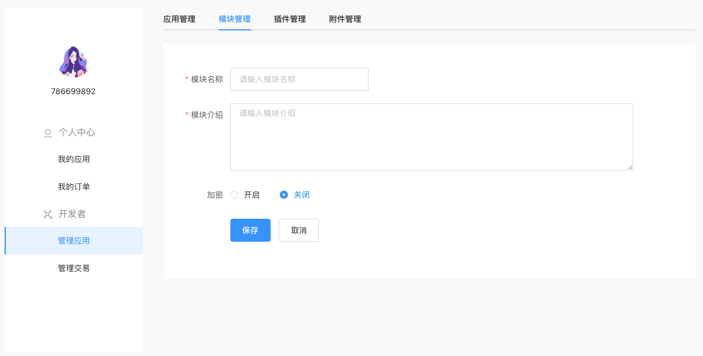
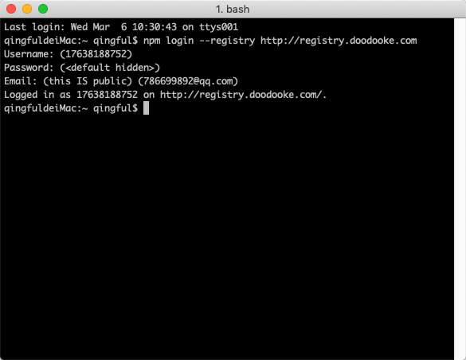
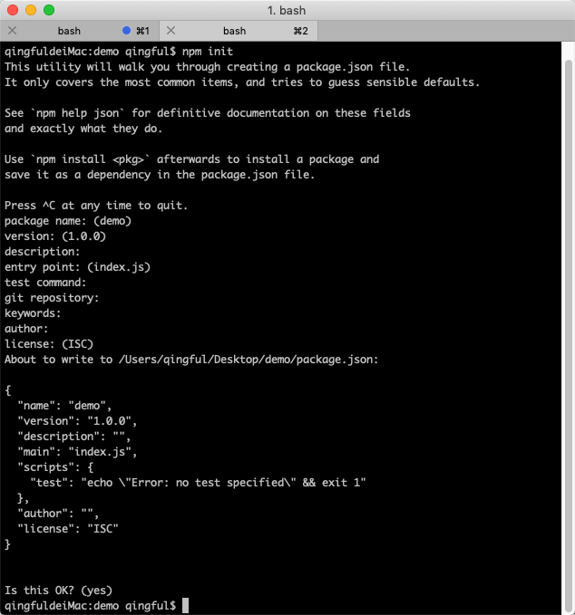
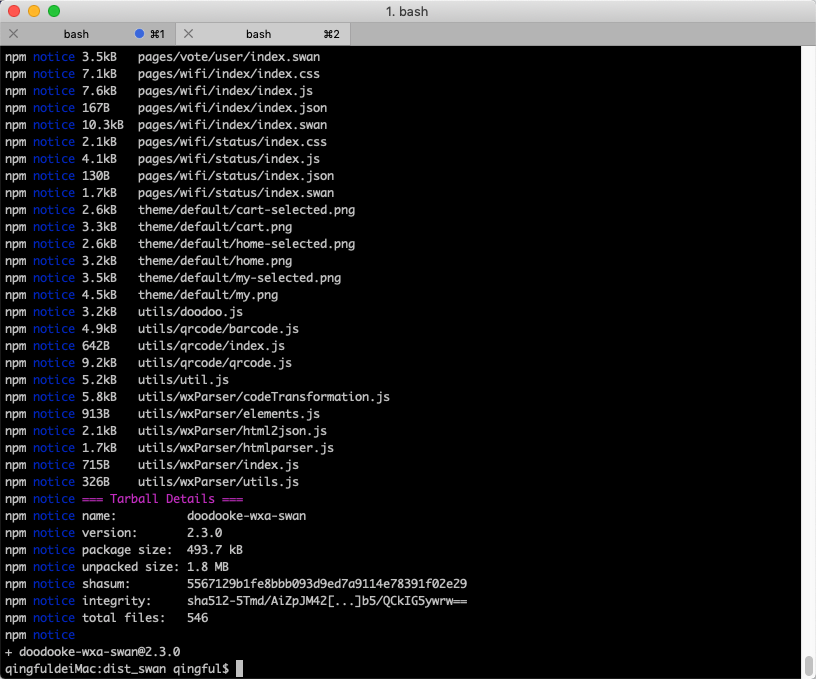
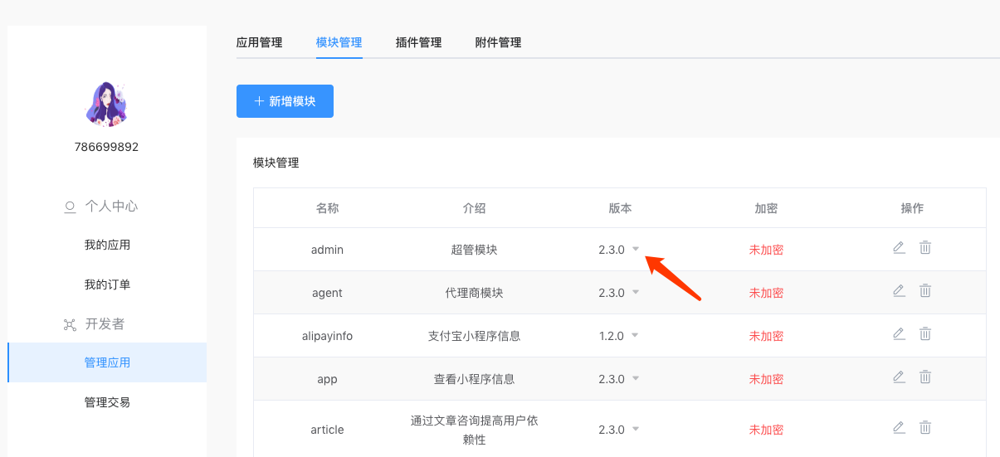
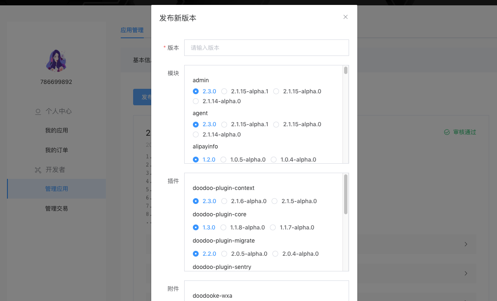

## 如何发布一个应用？

1. 申请成为开发者
申请链接 http://p5a4msdozpe55dze.mikecrm.com/BldTCuQ

2. 进入`开发者-管理应用-模块管理`，创建模块，输入模块名，介绍，是否加密等。

3. 打开终端，执行命令`npm login --registry http://registry.doodooke.com`

4. 创建模块，执行命令`npm init`

5. 上传模块，进入创建的模块目录，执行命令`npm publish --registry http://registry.doodooke.com`，提示如下即上传完成

6. 查看模块，上传完成之后，进入`开发者-管理应用-模块管理`

7. 进入`开发者-管理应用-应用管理-版本管理`，点击发布新版本，选择相应的模块发布，通过审核即可。

